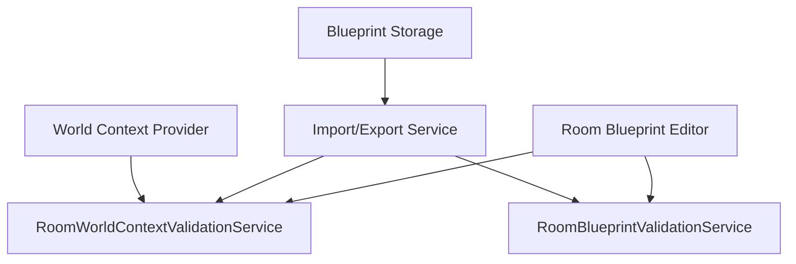

# Room World Context Validation Integration Guide

**Status:** ✅ COMPLETED - Integration patterns documented  
**Implementation Date:** 2025-12-19  
**Related Files:** `v1/src/app/services/room-world-context-validation.service.ts`, `v1/src/app/services/room-blueprint-validation.service.ts`, `v1/src/app/services/room-blueprint-import-export.service.ts`

## Overview

This guide provides practical integration patterns for incorporating Room World Context Validation into editor UI components, import/export workflows, and other SDK tools. It demonstrates how to wire the service with existing validation infrastructure while maintaining the structural fidelity requirements.

## Integration Architecture

### Service Dependencies



### Core Integration Points

1. **Editor UI Integration**: Real-time context validation during blueprint editing
2. **Import Pipeline Integration**: Context validation during blueprint import
3. **Export Pipeline Integration**: Context verification before blueprint export
4. **World Generator Integration**: Context-aware blueprint placement validation

## Editor UI Integration

### Blueprint Editor Component

```typescript
import { Component, OnInit, OnDestroy } from '@angular/core';
import { RoomWorldContextValidationService } from '../services/room-world-context-validation.service';
import { RoomBlueprintValidationService } from '../services/room-blueprint-validation.service';
import { RoomBlueprint, RoomWorldContext } from '../models/room-blueprint.models';
import { Subscription } from 'rxjs';

@Component({
  selector: 'app-blueprint-editor',
  template: `
    <div class="editor-container">
      <div class="context-panel">
        <app-world-context-selector 
          [context]="currentContext"
          (contextChange)="onContextChange($event)">
        </app-world-context-selector>
      </div>
      
      <div class="blueprint-editor">
        <app-blueprint-canvas 
          [blueprint]="currentBlueprint"
          (blueprintChange)="onBlueprintChange($event)">
        </app-blueprint-canvas>
      </div>
      
      <div class="validation-panel">
        <app-validation-summary 
          [structuralValidation]="structuralValidation"
          [contextValidation]="contextValidation">
        </app-validation-summary>
      </div>
    </div>
  `
})
export class BlueprintEditorComponent implements OnInit, OnDestroy {
  currentBlueprint: RoomBlueprint;
  currentContext: RoomWorldContext;
  structuralValidation: any;
  contextValidation: any;
  
  private validationSubscription: Subscription;

  constructor(
    private contextValidationService: RoomWorldContextValidationService,
    private structuralValidationService: RoomBlueprintValidationService,
    private contextProvider: WorldContextProvider
  ) {}

  ngOnInit(): void {
    // Initialize with default context
    this.currentContext = this.contextProvider.getDefaultContext();
    
    // Set up reactive validation
    this.validationSubscription = this.setupReactiveValidation();
  }

  ngOnDestroy(): void {
    this.validationSubscription?.unsubscribe();
  }

  onBlueprintChange(blueprint: RoomBlueprint): void {
    this.currentBlueprint = blueprint;
    this.validateBlueprint();
  }

  onContextChange(context: RoomWorldContext): void {
    this.currentContext = context;
    this.validateBlueprint();
  }

  private setupReactiveValidation(): Subscription {
    return new Subscription();
  }

  private validateBlueprint(): void {
    // Structural validation (existing)
    this.structuralValidation = this.structuralValidationService.validateBlueprint(
      this.currentBlueprint
    );

    // Context validation (new)
    this.contextValidation = this.contextValidationService.validatePlacement(
      this.currentBlueprint,
      this.currentContext
    );

    // Combine and display results
    this.displayCombinedValidation();
  }

  private displayCombinedValidation(): void {
    const allNotices = [
      ...this.structuralValidation.notices.map(n => ({
        ...n,
        category: 'structural' as const,
        source: 'RoomBlueprintValidationService'
      })),
      ...this.contextValidation.notices.map(n => ({
        path: 'context',
        message: n.message,
        severity: n.severity,
        category: 'context' as const,
        source: 'RoomWorldContextValidationService',
        code: n.code
      }))
    ];

    // Update UI with combined validation feedback
    this.validationPanel.updateValidation(allNotices);
    
    // Enable/disable save based on critical errors
    const hasBlockingErrors = allNotices.some(n => 
      n.severity === 'error' && n.category === 'structural'
    );
    this.saveButton.disabled = hasBlockingErrors;
    
    // Show context warnings as non-blocking alerts
    const contextWarnings = allNotices.filter(n => 
      n.category === 'context' && n.severity === 'warning'
    );
    if (contextWarnings.length > 0) {
      this.showContextWarnings(contextWarnings);
    }
  }
}
```

### World Context Selector Component

```typescript
import { Component, EventEmitter, Output, Input } from '@angular/core';
import { RoomWorldContext } from '../models/room-blueprint.models';
import { Biome } from '../enums/Biome';
import { SettlementType } from '../enums/SettlementType';
import { StructureType } from '../enums/StructureType';

@Component({
  selector: 'app-world-context-selector',
  template: `
    <div class="context-selector">
      <h3>World Context</h3>
      
      <div class="context-field">
        <label>Biome</label>
        <select [(ngModel)]="context.biome" (change)="emitChange()">
          <option [ngValue]="null">Select Biome...</option>
          <option *ngFor="let biome of availableBiomes" [ngValue]="biome">
            {{ biome | titlecase }}
          </option>
        </select>
      </div>
      
      <div class="context-field">
        <label>Settlement Type</label>
        <select [(ngModel)]="context.settlementType" (change)="emitChange()">
          <option [ngValue]="null">Select Settlement...</option>
          <option *ngFor="let settlement of availableSettlements" [ngValue]="settlement">
            {{ settlement | titlecase }}
          </option>
        </select>
      </div>
      
      <div class="context-field">
        <label>Structure Type</label>
        <select [(ngModel)]="context.structureType" (change)="emitChange()">
          <option [ngValue]="null">Select Structure...</option>
          <option *ngFor="let structure of availableStructures" [ngValue]="structure">
            {{ structure | titlecase }}
          </option>
        </select>
      </div>
      
      <div class="context-presets">
        <h4>Quick Presets</h4>
        <button *ngFor="let preset of contextPresets" 
                (click)="applyPreset(preset)"
                class="preset-button">
          {{ preset.name }}
        </button>
      </div>
    </div>
  `
})
export class WorldContextSelectorComponent {
  @Input() context: RoomWorldContext = {};
  @Output() contextChange = new EventEmitter<RoomWorldContext>();

  availableBiomes = Object.values(Biome);
  availableSettlements = Object.values(SettlementType);
  availableStructures = Object.values(StructureType);

  contextPresets = [
    {
      name: 'Coastal Trade Hub',
      context: {
        biome: Biome.Ocean,
        settlementType: SettlementType.TradeHub,
        structureType: StructureType.Harbor
      }
    },
    {
      name: 'Mountain Mining Camp',
      context: {
        biome: Biome.Rock,
        settlementType: SettlementType.Village,
        structureType: StructureType.Mine
      }
    },
    {
      name: 'Forest Hamlet',
      context: {
        biome: Biome.Forest,
        settlementType: SettlementType.Hamlet,
        structureType: StructureType.House
      }
    }
  ];

  emitChange(): void {
    this.contextChange.emit(this.context);
  }

  applyPreset(preset: any): void {
    this.context = { ...preset.context };
    this.emitChange();
  }
}
```

### Validation Summary Component

```typescript
import { Component, Input, OnChanges } from '@angular/core';

interface CombinedValidationNotice {
  path: string;
  message: string;
  severity: 'error' | 'warning' | 'info';
  category: 'structural' | 'context';
  source: string;
  code?: string;
}

@Component({
  selector: 'app-validation-summary',
  template: `
    <div class="validation-summary">
      <h3>Validation Results</h3>
      
      <div class="validation-stats">
        <div class="stat">
          <span class="error-count">{{ errorCount }}</span>
          <span class="label">Errors</span>
        </div>
        <div class="stat">
          <span class="warning-count">{{ warningCount }}</span>
          <span class="label">Warnings</span>
        </div>
        <div class="stat">
          <span class="info-count">{{ infoCount }}</span>
          <span class="label">Info</span>
        </div>
      </div>
      
      <div class="validation-notices">
        <div *ngFor="let notice of notices" 
             class="validation-notice"
             [class.error]="notice.severity === 'error'"
             [class.warning]="notice.severity === 'warning'"
             [class.info]="notice.severity === 'info'"
             [class.context]="notice.category === 'context'">
          
          <div class="notice-header">
            <span class="notice-source">{{ notice.source }}</span>
            <span class="notice-severity">{{ notice.severity | uppercase }}</span>
            <span *ngIf="notice.code" class="notice-code">{{ notice.code }}</span>
          </div>
          
          <div class="notice-message">{{ notice.message }}</div>
          
          <div class="notice-actions" *ngIf="notice.category === 'context'">
            <button (click)="showContextHelp(notice.code)">Help</button>
            <button (click)="suggestAlternatives(notice)">Alternatives</button>
          </div>
        </div>
      </div>
      
      <div class="validation-actions">
        <button (click)="exportValidationReport()" 
                [disabled]="notices.length === 0">
          Export Report
        </button>
        <button (click)="clearValidation()">Clear</button>
      </div>
    </div>
  `
})
export class ValidationSummaryComponent implements OnChanges {
  @Input() structuralValidation: any;
  @Input() contextValidation: any;
  
  notices: CombinedValidationNotice[] = [];
  errorCount = 0;
  warningCount = 0;
  infoCount = 0;

  ngOnChanges(): void {
    this.updateValidationDisplay();
  }

  private updateValidationDisplay(): void {
    this.notices = [
      ...this.extractStructuralNotices(),
      ...this.extractContextNotices()
    ];
    
    this.errorCount = this.notices.filter(n => n.severity === 'error').length;
    this.warningCount = this.notices.filter(n => n.severity === 'warning').length;
    this.infoCount = this.notices.filter(n => n.severity === 'info').length;
  }

  private extractStructuralNotices(): CombinedValidationNotice[] {
    if (!this.structuralValidation?.notices) return [];
    
    return this.structuralValidation.notices.map((notice: any) => ({
      ...notice,
      category: 'structural' as const,
      source: 'Structure Validator'
    }));
  }

  private extractContextNotices(): CombinedValidationNotice[] {
    if (!this.contextValidation?.notices) return [];
    
    return this.contextValidation.notices.map((notice: any) => ({
      path: 'context',
      message: notice.message,
      severity: notice.severity,
      category: 'context' as const,
      source: 'Context Validator',
      code: notice.code
    }));
  }

  showContextHelp(code?: string): void {
    // Show contextual help for specific validation codes
    const helpContent = this.getHelpForCode(code);
    this.dialogService.showHelp(helpContent);
  }

  suggestAlternatives(notice: CombinedValidationNotice): void {
    // Provide alternative suggestions based on validation code
    const suggestions = this.getSuggestionsForCode(notice.code);
    this.dialogService.showSuggestions(suggestions);
  }

  private getHelpForCode(code?: string): string {
    const helpMap: Record<string, string> = {
      'hazard-biome-vacuum': 'Vacuum hazards are only appropriate in exposed high-altitude, coastal, or void-linked biomes.',
      'structure-biome-mismatch': 'This structure type requires specific biome conditions to function properly.',
      'room-size-out-of-scale': 'Room exceeds the scale constraints for this settlement type.'
    };
    return helpMap[code || ''] || 'No additional help available.';
  }

  private getSuggestionsForCode(code?: string): string[] {
    const suggestionMap: Record<string, string[]> = {
      'hazard-biome-vacuum': [
        'Use Pressure hazard instead',
        'Use Intrusion hazard instead',
        'Change to Alpine or Coastal biome'
      ],
      'structure-biome-mismatch': [
        'Relocate to appropriate biome',
        'Change structure type',
        'Use generic building type'
      ],
      'room-size-out-of-scale': [
        'Split into multiple smaller rooms',
        'Target larger settlement type',
        'Reduce room dimensions'
      ]
    };
    return suggestionMap[code || ''] || ['Review context alignment'];
  }
}
```

## Import/Export Integration

### Enhanced Import Service

```typescript
import { Injectable } from '@angular/core';
import { RoomBlueprintImportExportService } from './room-blueprint-import-export.service';
import { RoomWorldContextValidationService } from './room-world-context-validation.service';
import { RoomBlueprint, RoomWorldContext } from '../models/room-blueprint.models';

@Injectable({
  providedIn: 'root'
})
export class EnhancedBlueprintImportService {
  constructor(
    private baseImportService: RoomBlueprintImportExportService,
    private contextValidationService: RoomWorldContextValidationService
  ) {}

  async importBlueprintWithContext(
    file: File, 
    worldContext: RoomWorldContext
  ): Promise<ImportResult> {
    try {
      // Step 1: Base import with structural validation
      const importResult = await this.baseImportService.importRoomBlueprint(
        await file.text()
      );

      // Step 2: Context validation
      const contextValidation = this.contextValidationService.validatePlacement(
        importResult.blueprint,
        worldContext
      );

      // Step 3: Combine validation results
      const combinedValidation = this.combineValidationResults(
        importResult.validation,
        contextValidation
      );

      // Step 4: Generate import report
      const importReport = this.generateImportReport(
        importResult,
        contextValidation,
        combinedValidation
      );

      return {
        blueprint: importResult.blueprint,
        orderedBlueprint: importResult.orderedBlueprint,
        structuralValidation: importResult.validation,
        contextValidation,
        combinedValidation,
        importReport
      };
    } catch (error) {
      throw new BlueprintImportError(`Failed to import blueprint: ${error.message}`);
    }
  }

  private combineValidationResults(
    structural: any, 
    context: any
  ): CombinedValidationResult {
    const structuralNotices = structural.issues || [];
    const contextNotices = context.notices?.map((n: any) => ({
      path: 'context',
      message: n.message,
      severity: n.severity === 'warning' ? 'warning' : 'info',
      code: n.code,
      category: 'context'
    })) || [];

    return {
      hasErrors: structural.hasErrors,
      issues: [...structuralNotices, ...contextNotices],
      issuesByPath: this.groupIssuesByPath([...structuralNotices, ...contextNotices])
    };
  }

  private generateImportReport(
    importResult: any,
    contextValidation: any,
    combinedValidation: any
  ): ImportReport {
    return {
      fileName: importResult.fileName,
      blueprintId: importResult.blueprint.id,
      importTimestamp: new Date().toISOString(),
      structuralIssues: importResult.validation.issues.length,
      contextIssues: contextValidation.notices.length,
      isValid: !combinedValidation.hasErrors,
      recommendations: this.generateRecommendations(contextValidation.notices)
    };
  }

  private generateRecommendations(notices: any[]): string[] {
    const recommendations: string[] = [];
    
    notices.forEach(notice => {
      switch (notice.code) {
        case 'hazard-biome-vacuum':
          recommendations.push('Consider using Pressure or Intrusion hazards for non-vacuum environments');
          break;
        case 'room-size-out-of-scale':
          recommendations.push('Split large rooms or target larger settlement types for better fit');
          break;
        case 'structure-biome-mismatch':
          recommendations.push('Relocate to compatible biome or use more generic structure type');
          break;
      }
    });

    return recommendations;
  }
}
```

### Export Validation Integration

```typescript
@Injectable({
  providedIn: 'root'
})
export class BlueprintExportValidationService {
  constructor(
    private contextValidationService: RoomWorldContextValidationService,
    private worldContextProvider: WorldContextProvider
  ) {}

  validateExportReadiness(blueprint: RoomBlueprint): ExportValidationResult {
    // Get current world context for export validation
    const currentContext = this.worldContextProvider.getCurrentContext();
    
    // Validate blueprint in current context
    const contextValidation = this.contextValidationService.validatePlacement(
      blueprint,
      currentContext
    );

    // Check for context-dependent features
    const contextDependencies = this.analyzeContextDependencies(blueprint);
    
    return {
      isExportReady: contextValidation.notices.length === 0,
      validationResult: contextValidation,
      contextDependencies,
      exportWarnings: this.generateExportWarnings(contextValidation, contextDependencies),
      recommendedContext: this.suggestOptimalContext(blueprint)
    };
  }

  private analyzeContextDependencies(blueprint: RoomBlueprint): ContextDependency[] {
    const dependencies: ContextDependency[] = [];

    // Analyze hazard dependencies
    if (blueprint.hazards.includes(HazardType.Vacuum)) {
      dependencies.push({
        type: 'hazard',
        element: 'vacuum',
        requiresBiomes: [Biome.Alpine, Biome.Beach, Biome.Ocean, Biome.Rock],
        requiresSettlements: [SettlementType.UndergroundCity, SettlementType.FloatingCity]
      });
    }

    // Analyze structure dependencies
    if (blueprint.structureType === StructureType.Harbor) {
      dependencies.push({
        type: 'structure',
        element: 'harbor',
        requiresBiomes: [Biome.Ocean, Biome.Water, Biome.Beach]
      });
    }

    return dependencies;
  }

  private generateExportWarnings(
    validation: any, 
    dependencies: ContextDependency[]
  ): ExportWarning[] {
    const warnings: ExportWarning[] = [];

    // Context mismatch warnings
    validation.notices.forEach((notice: any) => {
      warnings.push({
        type: 'context_mismatch',
        severity: notice.severity,
        message: notice.message,
        impact: 'Blueprint may not function optimally in current world context'
      });
    });

    // Dependency warnings
    dependencies.forEach(dep => {
      if (dep.requiresBiomes.length > 0) {
        warnings.push({
          type: 'biome_dependency',
          severity: 'info',
          message: `Blueprint features depend on specific biomes: ${dep.requiresBiomes.join(', ')}`,
          impact: 'Export to worlds without these biomes may require modifications'
        });
      }
    });

    return warnings;
  }

  private suggestOptimalContext(blueprint: RoomBlueprint): RoomWorldContext {
    // Analyze blueprint to suggest optimal world context
    const suggestions: RoomWorldContext = {};

    // Suggest biome based on hazards and structure
    if (blueprint.hazards.includes(HazardType.Vacuum)) {
      suggestions.biome = Biome.Alpine;
    } else if (blueprint.structureType === StructureType.Harbor) {
      suggestions.biome = Biome.Ocean;
    } else {
      suggestions.biome = Biome.Grassland; // Safe default
    }

    // Suggest settlement type based on room size
    const area = blueprint.width * blueprint.height;
    if (area <= 96) {
      suggestions.settlementType = SettlementType.Hamlet;
    } else if (area <= 144) {
      suggestions.settlementType = SettlementType.Village;
    } else {
      suggestions.settlementType = SettlementType.Town;
    }

    return suggestions;
  }
}
```

## World Generator Integration

### Context-Aware Placement Validation

```typescript
@Injectable({
  providedIn: 'root'
})
export class WorldPlacementValidator {
  constructor(
    private contextValidationService: RoomWorldContextValidationService,
    private biomeGenerator: BiomeGenerator,
    private settlementGenerator: SettlementGenerator
  ) {}

  validateBlueprintPlacement(
    blueprint: RoomBlueprint,
    worldCell: WorldCell,
    nearbyCells: WorldCell[]
  ): PlacementValidationResult {
    // Derive context from world data
    const context = this.deriveContextFromWorld(worldCell, nearbyCells);
    
    // Validate placement
    const validation = this.contextValidationService.validatePlacement(
      blueprint,
      context
    );

    // Generate placement suggestions
    const suggestions = this.generatePlacementSuggestions(
      blueprint,
      validation,
      worldCell,
      nearbyCells
    );

    return {
      isValidPlacement: validation.notices.every(n => n.severity !== 'warning'),
      validationResult: validation,
      suggestions,
      alternativeLocations: this.findAlternativeLocations(blueprint, worldCell)
    };
  }

  private deriveContextFromWorld(
    cell: WorldCell, 
    nearby: WorldCell[]
  ): RoomWorldContext {
    return {
      biome: cell.biome,
      settlementType: this.inferSettlementType(cell, nearby),
      structureType: this.inferStructureType(cell)
    };
  }

  private generatePlacementSuggestions(
    blueprint: RoomBlueprint,
    validation: any,
    currentCell: WorldCell,
    nearbyCells: WorldCell[]
  ): PlacementSuggestion[] {
    const suggestions: PlacementSuggestion[] = [];

    validation.notices.forEach((notice: any) => {
      switch (notice.code) {
        case 'structure-biome-mismatch':
          suggestions.push({
            type: 'biome_adjustment',
            description: 'Move to biome compatible with structure type',
            alternativeBiomes: this.findCompatibleBiomes(notice.context.structureType),
            priority: 'high'
          });
          break;

        case 'hazard-biome-vacuum':
          suggestions.push({
            type: 'hazard_adjustment',
            description: 'Adjust hazards for current biome',
            alternativeHazards: this.suggestAlternativeHazards(blueprint.hazards, currentCell.biome),
            priority: 'medium'
          });
          break;

        case 'room-size-out-of-scale':
          suggestions.push({
            type: 'scale_adjustment',
            description: 'Resize blueprint for settlement scale',
            alternativeSizes: this.suggestBlueprintSizes(blueprint, notice.context.settlementType),
            priority: 'high'
          });
          break;
      }
    });

    return suggestions;
  }

  private findAlternativeLocations(
    blueprint: RoomBlueprint,
    currentCell: WorldCell
  ): WorldCell[] {
    // Find nearby cells that would provide better context alignment
    return this.worldGrid.getNearbyCells(currentCell, 3)
      .filter(cell => this.isBetterContext(blueprint, currentCell, cell))
      .slice(0, 5); // Return top 5 alternatives
  }

  private isBetterContext(
    blueprint: RoomBlueprint,
    currentCell: WorldCell,
    candidateCell: WorldCell
  ): boolean {
    const currentContext = this.deriveContextFromWorld(currentCell, []);
    const candidateContext = this.deriveContextFromWorld(candidateCell, []);
    
    const currentValidation = this.contextValidationService.validatePlacement(blueprint, currentContext);
    const candidateValidation = this.contextValidationService.validatePlacement(blueprint, candidateContext);
    
    // Prefer locations with fewer/smaller severity notices
    return candidateValidation.notices.length < currentValidation.notices.length;
  }
}
```

## Best Practices for Integration

### 1. Separation of Concerns
```typescript
// Good - separate validation concerns
const structuralResult = structuralValidationService.validateBlueprint(blueprint);
const contextResult = contextValidationService.validatePlacement(blueprint, context);
const combinedResult = combineValidationResults(structuralResult, contextResult);

// Bad - mixing validation concerns
const mixedResult = someValidationService.validateEverything(blueprint, context);
```

### 2. Reactive Updates
```typescript
// Good - reactive validation updates
blueprint$.pipe(
  switchMap(blueprint => 
    combineLatest([
      of(blueprint),
      context$,
      worldState$
    ])
  ),
  switchMap(([blueprint, context, worldState]) => 
    contextValidationService.validatePlacement(blueprint, context)
  )
).subscribe(validation => {
  this.updateValidationDisplay(validation);
});

// Bad - manual validation triggering
onBlueprintChanged() {
  this.manualValidation();
}
```

### 3. Error Handling
```typescript
// Good - graceful degradation
try {
  const result = this.contextValidationService.validatePlacement(blueprint, context);
  return result;
} catch (error) {
  console.warn('Context validation failed, falling back to basic validation:', error);
  return { notices: [] };
}

// Bad - failing hard on validation errors
const result = this.contextValidationService.validatePlacement(blueprint, context);
if (error) throw error; // May break user workflow
```

### 4. Performance Optimization
```typescript
// Good - debounced validation
blueprint$.pipe(
  debounceTime(300),
  distinctUntilChanged((prev, curr) => JSON.stringify(prev) === JSON.stringify(curr)),
  switchMap(blueprint => this.validateBlueprint(blueprint))
).subscribe();

// Bad - validation on every keystroke
blueprint$.subscribe(blueprint => this.validateBlueprint(blueprint));
```

## Testing Integration

### Mock World Context Provider

```typescript
// Test utility for integration testing
export class MockWorldContextProvider {
  private contexts = new Map<string, RoomWorldContext>();

  setContext(id: string, context: RoomWorldContext): void {
    this.contexts.set(id, context);
  }

  getContext(id: string): RoomWorldContext {
    return this.contexts.get(id) || this.getDefaultContext();
  }

  getDefaultContext(): RoomWorldContext {
    return {
      biome: Biome.Grassland,
      settlementType: SettlementType.Village,
      structureType: StructureType.House
    };
  }
}

// Usage in tests
describe('BlueprintEditor Integration', () => {
  let editor: BlueprintEditorComponent;
  let mockContextProvider: MockWorldContextProvider;

  beforeEach(() => {
    mockContextProvider = new MockWorldContextProvider();
    TestBed.configureTestingModule({
      providers: [
        { provide: WorldContextProvider, useValue: mockContextProvider }
      ]
    });
  });

  it('should update context validation when world context changes', () => {
    const context: RoomWorldContext = {
      biome: Biome.Desert,
      settlementType: SettlementType.Hamlet,
      structureType: StructureType.Harbor
    };
    
    mockContextProvider.setContext('test', context);
    editor.selectContext('test');
    
    const validation = editor.getContextValidation();
    expect(validation.notices.some(n => n.code === 'structure-biome-mismatch')).toBeTrue();
  });
});
```

## Conclusion

The Room World Context Validation service integrates seamlessly with existing editor UI and import/export workflows while maintaining the structural fidelity requirements. The integration patterns demonstrated here ensure consistent validation behavior across all SDK tools while providing clear, actionable feedback to users.

Key integration benefits:
- **Consistent Validation**: Same validation logic across editor, import, and export
- **Clear Feedback**: Context-aware suggestions and alternatives
- **Graceful Degradation**: Service continues to function even with partial context data
- **Performance Optimized**: Reactive patterns and debouncing for responsive UI