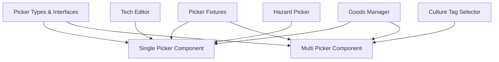

# SDK Picker UX Patterns Integration Guide

**Status:** ✅ COMPLETED - Structural fidelity achieved  
**Implementation Date:** 2025-12-19  
**Related Files:** `v1/src/app/components/sdk/shared/picker/`

## Overview

This guide provides comprehensive integration patterns for the SDK Picker UX Components across different tools and contexts. It demonstrates how to implement deterministic, discoverable selection UI that stays DRY (Don't Repeat Yourself) across SDK tools while maintaining charter compliance.

## Component Architecture

### Core Components



### Component Overview

| Component | Use Case | Selection Mode | Key Features |
|-----------|----------|----------------|--------------|
| `SinglePickerComponent` | Single selection from list | Radio button style | Search, keyboard nav, accessibility |
| `MultiPickerComponent` | Multiple selections | Chip-based interface | Add/remove chips, bulk operations |
| `PickerFixtures` | Reusable data adapters | N/A | Mock data, test scenarios |

## Integration Patterns

### 1. Goods Manager Integration

#### Single-Select Goods Category Picker

```typescript
import { Component, OnInit } from '@angular/core';
import { SinglePickerComponent } from '../shared/picker/single-picker.component';
import { PickerItem, PickerAdapter, PickerConfig } from '../shared/picker/picker.types';
import { GoodsPickerFixture } from '../shared/picker/picker-fixtures';

@Component({
  selector: 'app-goods-manager',
  template: `
    <div class="goods-manager">
      <h2>Goods Manager</h2>
      
      <div class="form-section">
        <label>Primary Category</label>
        <app-single-picker
          [adapter]="goodsCategoryAdapter"
          [config]="categoryConfig"
          [selectedItem]="selectedCategory"
          (selectionChange)="onCategoryChange($event)"
          (pickerEvent)="onPickerEvent($event)"
          [a11y]="{ 'aria-label': 'Select goods category' }">
        </app-single-picker>
      </div>

      <div class="form-section" *ngIf="selectedCategory">
        <label>Specific Goods</label>
        <app-single-picker
          [adapter]="specificGoodsAdapter"
          [config]="goodsConfig"
          [selectedItem]="selectedGoods"
          (selectionChange)="onGoodsChange($event)"
          [a11y]="{ 'aria-label': 'Select specific goods item' }">
        </app-single-picker>
      </div>

      <div class="goods-details" *ngIf="selectedGoods">
        <h3>{{ selectedGoods.label }} Details</h3>
        <div class="goods-metadata">
          <span>Type: {{ selectedGoods.metadata?.type }}</span>
          <span>Category: {{ selectedGoods.metadata?.category }}</span>
        </div>
      </div>
    </div>
  `,
  styleUrls: ['./goods-manager.component.scss']
})
export class GoodsManagerComponent implements OnInit {
  selectedCategory: PickerItem | null = null;
  selectedGoods: PickerItem | null = null;
  
  goodsCategoryAdapter: PickerAdapter<PickerItem>;
  specificGoodsAdapter: PickerAdapter<PickerItem>;
  
  categoryConfig: PickerConfig = {
    placeholder: 'Select category...',
    searchable: true,
    showIcons: true,
    maxItems: 20
  };

  goodsConfig: PickerConfig = {
    placeholder: 'Select goods item...',
    searchable: true,
    showIcons: true,
    maxItems: 50
  };

  constructor() {
    this.goodsCategoryAdapter = new MockGoodsCategoryAdapter();
    this.specificGoodsAdapter = new GoodsPickerFixture();
  }

  ngOnInit(): void {
    // Initialize with default selection
    this.selectedCategory = this.goodsCategoryAdapter.getItems()[0];
  }

  onCategoryChange(category: PickerItem): void {
    this.selectedCategory = category;
    this.selectedGoods = null;
    
    // Filter specific goods adapter based on category
    this.specificGoodsAdapter = this.createFilteredGoodsAdapter(category);
  }

  onGoodsChange(goods: PickerItem): void {
    this.selectedGoods = goods;
    this.updateGoodsDetails(goods);
  }

  onPickerEvent(event: any): void {
    console.log('Picker event:', event);
    
    switch (event.type) {
      case 'search':
        this.trackSearchUsage(event.data);
        break;
      case 'open':
        this.trackPickerUsage('category');
        break;
    }
  }

  private createFilteredGoodsAdapter(category: PickerItem): PickerAdapter<PickerItem> {
    const baseAdapter = new GoodsPickerFixture();
    return new FilteredGoodsAdapter(base);
  }

 Adapter, category.id private updateGoodsDetails(goods: PickerItem): void {
    // Update form with goods-specific information
    this.goodsDetailsForm.patchValue({
      basePrice: goods.metadata?.basePrice,
      rarity: goods.metadata?.rarity,
      category: goods.metadata?.category
    });
  }

  private trackSearchUsage(query: string): void {
    // Analytics tracking for search usage
    this.analyticsService.track('goods_search', { query, context: 'goods_manager' });
  }

  private trackPickerUsage(context: string): void {
    this.analyticsService.track('picker_opened', { context });
  }
}

// Mock adapter for goods categories
class MockGoodsCategoryAdapter implements PickerAdapter<PickerItem> {
  private categories = [
    { id: 'basic', label: 'Basic Resources', icon: 'resource' },
    { id: 'advanced', label: 'Advanced Materials', icon: 'advanced' },
    { id: 'consumables', label: 'Consumables', icon: 'food' },
    { id: 'components', label: 'Components', icon: 'parts' },
    { id: 'luxury', label: 'Luxury Goods', icon: 'luxury' }
  ];

  getItems(): PickerItem[] {
    return this.categories.map(cat => ({
      id: cat.id,
      label: cat.label,
      icon: cat.icon,
      metadata: { type: 'category' }
    }));
  }

  getItemById(id: string): PickerItem | undefined {
    return this.getItems().find(item => item.id === id);
  }

  searchItems(query: string): PickerItem[] {
    return this.getItems().filter(item => 
      item.label.toLowerCase().includes(query.toLowerCase())
    );
  }

  getSortComparator(): ((a: PickerItem, b: PickerItem) => number) | null {
    return (a, b) => a.label.localeCompare(b.label);
  }

  getGrouping(): ((item: PickerItem) => string) | null {
    return null;
  }
}
```

#### Multi-Select Goods Requirements

```typescript
@Component({
  selector: 'app-goods-requirements',
  template: `
    <div class="goods-requirements">
      <h3>Required Goods</h3>
      
      <app-multi-picker
        [adapter]="availableGoodsAdapter"
        [config]="requirementsConfig"
        [selectedItems]="requiredGoods"
        (selectionChange)="onRequirementsChange($event)"
        (pickerEvent)="onPickerEvent($event)"
        [a11y]="{ 'aria-label': 'Select required goods' }">
      </app-multi-picker>

      <div class="requirements-summary" *ngIf="requiredGoods.length > 0">
        <h4>Selected Requirements ({{ requiredGoods.length }} items)</h4>
        <div class="chips-container">
          <div *ngFor="let good of requiredGoods" class="requirement-chip">
            <app-icon [name]="good.icon" class="chip-icon"></app-icon>
            <span>{{ good.label }}</span>
            <button (click)="removeRequirement(good)" class="remove-btn">×</button>
          </div>
        </div>
      </div>
    </div>
  `
})
export class GoodsRequirementsComponent {
  requiredGoods: PickerItem[] = [];
  
  requirementsConfig: PickerConfig = {
    placeholder: 'Add required goods...',
    searchable: true,
    showIcons: true,
    maxItems: 100
  };

  availableGoodsAdapter = new GoodsPickerFixture();

  onRequirementsChange(goods: PickerItem[]): void {
    this.requiredGoods = goods;
    this.validateRequirements();
  }

  removeRequirement(good: PickerItem): void {
    this.requiredGoods = this.requiredGoods.filter(g => g.id !== good.id);
  }

  private validateRequirements(): void {
    // Business logic validation
    const conflicts = this.detectConflicts(this.requiredGoods);
    if (conflicts.length > 0) {
      this.showWarning('Some requirements conflict with each other');
    }
  }
}
```

### 2. Tech Editor Integration

#### Tech Tree Category Picker

```typescript
@Component({
  selector: 'app-tech-editor',
  template: `
    <div class="tech-editor">
      <div class="editor-header">
        <h2>Technology Editor</h2>
      </div>

      <div class="editor-content">
        <div class="form-section">
          <label>Technology Category</label>
          <app-single-picker
            [adapter]="techCategoryAdapter"
            [config]="categoryConfig"
            [selectedItem]="selectedCategory"
            (selectionChange)="onCategoryChange($event)">
          </app-single-picker>
        </div>

        <div class="form-section">
          <label>Prerequisites</label>
          <app-multi-picker
            [adapter]="techPrerequisitesAdapter"
            [config]="prerequisitesConfig"
            [selectedItems]="selectedPrerequisites"
            (selectionChange)="onPrerequisitesChange($event)">
          </app-multi-picker>
        </div>

        <div class="form-section">
          <label>Unlocks</label>
          <app-multi-picker
            [adapter]="techUnlocksAdapter"
            [config]="unlocksConfig"
            [selectedItems]="selectedUnlocks"
            (selectionChange)="onUnlocksChange($event)">
          </app-multi-picker>
        </div>
      </div>
    </div>
  `
})
export class TechEditorComponent {
  selectedCategory: PickerItem | null = null;
  selectedPrerequisites: PickerItem[] = [];
  selectedUnlocks: PickerItem[] = [];

  techCategoryAdapter = new TechCategoryAdapter();
  techPrerequisitesAdapter = new TechPickerFixture();
  techUnlocksAdapter = new TechPickerFixture();

  categoryConfig: PickerConfig = {
    placeholder: 'Select tech category...',
    searchable: true,
    showIcons: true
  };

  prerequisitesConfig: PickerConfig = {
    placeholder: 'Add prerequisite...',
    searchable: true,
    showIcons: true
  };

  unlocksConfig: PickerConfig = {
    placeholder: 'Add unlock...',
    searchable: true,
    showIcons: true
  };

  onCategoryChange(category: PickerItem): void {
    this.selectedCategory = category;
    // Filter available techs based on category
    this.filterTechsByCategory(category.id);
  }

  onPrerequisitesChange(prerequisites: PickerItem[]): void {
    this.selectedPrerequisites = prerequisites;
    this.validatePrerequisites();
  }

  onUnlocksChange(unlocks: PickerItem[]): void {
    this.selectedUnlocks = unlocks;
  }

  private filterTechsByCategory(categoryId: string): void {
    // Logic to filter tech adapter based on category
    const allTechs = new TechPickerFixture().getItems();
    const filtered = allTechs.filter(tech => tech.metadata?.category === categoryId);
    
    // Update adapters with filtered results
    this.updateTechAdapters(filtered);
  }

  private validatePrerequisites(): void {
    // Check for circular dependencies
    const hasCircularDeps = this.detectCircularDependencies(this.selectedPrerequisites);
    if (hasCircularDeps) {
      this.showError('Circular dependency detected in prerequisites');
    }
  }
}
```

### 3. Hazard Picker Integration

#### Room Blueprint Hazard Selection

```typescript
@Component({
  selector: 'app-hazard-picker',
  template: `
    <div class="hazard-picker">
      <h3>Room Hazards</h3>
      
      <div class="picker-section">
        <label>Primary Hazards</label>
        <app-multi-picker
          [adapter]="primaryHazardsAdapter"
          [config]="hazardsConfig"
          [selectedItems]="selectedHazards"
          (selectionChange)="onHazardsChange($event)"
          (pickerEvent)="onHazardEvent($event)">
        </app-multi-picker>
      </div>

      <div class="hazard-details" *ngIf="selectedHazards.length > 0">
        <h4>Hazard Analysis</h4>
        <div class="hazard-grid">
          <div *ngFor="let hazard of selectedHazards" 
               class="hazard-card"
               [class.severity-high]="hazard.metadata?.severity === 'high'"
               [class.severity-medium]="hazard.metadata?.severity === 'medium'"
               [class.severity-low]="hazard.metadata?.severity === 'low'">
            
            <div class="hazard-header">
              <app-icon [name]="hazard.icon" class="hazard-icon"></app-icon>
              <span class="hazard-name">{{ hazard.label }}</span>
              <span class="severity-badge">{{ hazard.metadata?.severity }}</span>
            </div>
            
            <div class="hazard-metadata">
              <span>Category: {{ hazard.metadata?.category }}</span>
              <span>Mitigation: {{ getMitigationStrategy(hazard) }}</span>
            </div>
          </div>
        </div>
      </div>

      <div class="validation-warnings" *ngIf="validationWarnings.length > 0">
        <h4>Warnings</h4>
        <div *ngFor="let warning of validationWarnings" class="warning-item">
          <app-icon name="warning" class="warning-icon"></app-icon>
          <span>{{ warning.message }}</span>
        </div>
      </div>
    </div>
  `
})
export class HazardPickerComponent {
  selectedHazards: PickerItem[] = [];
  validationWarnings: Array<{ message: string; severity: string }> = [];
  
  primaryHazardsAdapter = new HazardPickerFixture();
  
  hazardsConfig: PickerConfig = {
    placeholder: 'Add hazards...',
    searchable: true,
    showIcons: true,
    maxItems: 15
  };

  onHazardsChange(hazards: PickerItem[]): void {
    this.selectedHazards = hazards;
    this.validateHazardCombination();
    this.updateRoomStats();
  }

  onHazardEvent(event: any): void {
    if (event.type === 'select' && event.item) {
      this.onHazardSelected(event.item);
    }
  }

  private validateHazardCombination(): void {
    this.validationWarnings = [];
    
    // Check for incompatible hazards
    const incompatible = this.findIncompatibleHazards(this.selectedHazards);
    incompatible.forEach(pair => {
      this.validationWarnings.push({
        message: `${pair[0].label} and ${pair[1].label} are difficult to mitigate together`,
        severity: 'warning'
      });
    });

    // Check for overwhelming combinations
    if (this.selectedHazards.length > 5) {
      this.validationWarnings.push({
        message: 'Too many hazards may make the room unmanageable',
        severity: 'info'
      });
    }
  }

  private findIncompatibleHazards(hazards: PickerItem[]): Array<[PickerItem, PickerItem]> {
    const incompatiblePairs: Array<[string, string]> = [
      ['fire', 'flood'], // Fighting fire with water vs preserving electronics
      ['vacuum', 'pressure'] // Conflicting environmental requirements
    ];

    const incompatibilities: Array<[PickerItem, PickerItem]> = [];

    for (const [haz1, haz2] of incompatiblePairs) {
      const item1 = hazards.find(h => h.id === haz1);
      const item2 = hazards.find(h => h.id === haz2);
      if (item1 && item2) {
        incompatibilities.push([item1, item2]);
      }
    }

    return incompatibilities;
  }

  getMitigationStrategy(hazard: PickerItem): string {
    const strategies: Record<string, string> = {
      'fire': 'Fire suppression systems, heat-resistant materials',
      'flood': 'Waterproofing, drainage systems',
      'electrical': 'Surge protectors, backup power',
      'vacuum': 'Sealed chambers, airlocks',
      'radiation': 'Lead shielding, remote operation'
    };
    
    return strategies[hazard.id] || 'Standard safety protocols';
  }

  private onHazardSelected(hazard: PickerItem): void {
    // Trigger analytics or specific handling for hazard selection
    this.analyticsService.track('hazard_selected', {
      hazardId: hazard.id,
      severityseverity,
     : hazard.metadata?. context: 'room_blueprint'
    });
  }
}
```

### 4. Culture Tag Selector Integration

#### Settlement Culture Configuration

```typescript
@Component({
  selector: 'app-culture-config',
  template: `
    <div class="culture-config">
      <h3>Culture Configuration</h3>
      
      <div class="culture-sections">
        <div class="section">
          <label>Primary Cultural Traits</label>
          <app-multi-picker
            [adapter]="cultureTraitsAdapter"
            [config]="traitsConfig"
            [selectedItems]="selectedTraits"
            (selectionChange)="onTraitsChange($event)">
          </app-multi-picker>
        </div>

        <div class="section">
          <label>Secondary Influences</label>
          <app-multi-picker
            [adapter]="cultureInfluencesAdapter"
            [config]="influencesConfig"
            [selectedItems]="selectedInfluences"
            (selectionChange)="onInfluencesChange($event)">
          </app-multi-picker>
        </div>

        <div class="section">
          <label>Forbidden Practices</label>
          <app-multi-picker
            [adapter]="cultureTaboosAdapter"
            [config]="taboosConfig"
            [selectedItems]="selectedTaboos"
            (selectionChange)="onTaboosChange($event)">
          </app-multi-picker>
        </div>
      </div>

      <div class="culture-summary" *ngIf="hasSelectedCultures()">
        <h4>Cultural Profile</h4>
        <div class="culture-description">
          <p>{{ getCultureDescription() }}</p>
        </div>
        
        <div class="culture-effects">
          <h5>Gameplay Effects</h5>
          <ul>
            <li *ngFor="let effect of getCultureEffects()">{{ effect }}</li>
          </ul>
        </div>
      </div>
    </div>
  `
})
export class CultureConfigComponent {
  selectedTraits: PickerItem[] = [];
  selectedInfluences: PickerItem[] = [];
  selectedTaboos: PickerItem[] = [];

  cultureTraitsAdapter = new CulturePickerFixture();
  cultureInfluencesAdapter = new CulturePickerFixture();
  cultureTaboosAdapter = new CulturePickerFixture();

  traitsConfig: PickerConfig = {
    placeholder: 'Select cultural traits...',
    searchable: true,
    showIcons: true,
    maxItems: 8
  };

  influencesConfig: PickerConfig = {
    placeholder: 'Add cultural influences...',
    searchable: true,
    showIcons: true,
    maxItems: 12
  };

  taboosConfig: PickerConfig = {
    placeholder: 'Select forbidden practices...',
    searchable: true,
    showIcons: true,
    maxItems: 6
  };

  onTraitsChange(traits: PickerItem[]): void {
    this.selectedTraits = traits;
    this.updateCultureProfile();
  }

  onInfluencesChange(influences: PickerItem[]): void {
    this.selectedInfluences = influences;
    this.updateCultureProfile();
  }

  onTaboosChange(taboos: PickerItem[]): void {
    this.selectedTaboos = taboos;
    this.updateCultureProfile();
  }

  hasSelectedCultures(): boolean {
    return this.selectedTraits.length > 0 || this.selectedInfluences.length > 0;
  }

  private updateCultureProfile(): void {
    // Recalculate culture description and effects
    this.cultureProfile = this.generateCultureProfile();
  }

  getCultureDescription(): string {
    if (this.selectedTraits.length === 0) {
      return 'No cultural traits selected.';
    }

    const primaryTrait = this.selectedTraits[0];
    const description = this.getTraitDescription(primaryTrait.id);
    
    if (this.selectedInfluences.length > 0) {
      const influences = this.selectedInfluences.map(i => i.label.toLowerCase()).join(', ');
      return `${description} Influenced by ${influences}.`;
    }
    
    return description;
  }

  private getTraitDescription(traitId: string): string {
    const descriptions: Record<string, string> = {
      'martial': 'A society focused on military prowess and warrior culture',
      'scholarly': 'An intellectual community that values knowledge and learning',
      'trading': 'A commercial culture centered on trade and commerce',
      'agricultural': 'A rural society focused on farming and land management',
      'artistic': 'A creative culture that values artistic expression',
      'religious': 'A spiritually-focused society with strong religious beliefs',
      'exploratory': 'An adventurous culture that seeks to explore and discover',
      'isolationist': 'A closed society that prefers to remain separate from others'
    };
    
    return descriptions[traitId] || 'A unique cultural profile.';
  }

  getCultureEffects(): string[] {
    const effects: string[] = [];
    
    this.selectedTraits.forEach(trait => {
      const traitEffects = this.getTraitEffects(trait.id);
      effects.push(...traitEffects);
    });

    // Remove duplicates and return
    return [...new Set(effects)];
  }

  private getTraitEffects(traitId: string): string[] {
    const effectMap: Record<string, string[]> = {
      'martial': [
        'Military units receive +20% combat effectiveness',
        'Unlocked: Barracks and military structures',
        'Population growth rate -10% due to warrior culture'
      ],
      'scholarly': [
        'Research speed +25%',
        'Unlocked: Libraries and schools',
        'Technology requirements reduced by 1 tier'
      ],
      'trading': [
        'Trade route income +30%',
        'Unlocked: Markets and trade posts',
        'Cultural diffusion increased'
      ],
      'agricultural': [
        'Food production +20%',
        'Unlocked: Advanced farming techniques',
        'Population growth rate +15%'
      ]
    };
    
    return effectMap[traitId] || [];
  }
}
```

## Accessibility Integration

### ARIA Attribute Configuration

```typescript
// Comprehensive accessibility setup
const a11yConfig = {
  // Single picker accessibility
  singlePicker: {
    'aria-label': 'Select settlement type',
    'aria-describedby': 'settlement-help-text',
    'aria-expanded': 'boolean',
    'aria-controls': 'dropdown-id'
  },
  
  // Multi picker accessibility  
  multiPicker: {
    'aria-label': 'Select multiple hazards',
    'aria-describedby': 'hazards-help-text',
    'aria-multiselectable': 'true'
  }
};

// Usage in components
<a11y]="getPickerA11y('goods-category')" 
```

### Keyboard Navigation Guidelines

#### Standard Keyboard Interactions

| Key | Action | Context |
|-----|--------|---------|
| `Arrow Down` | Open picker / Move focus down | Trigger / List |
| `Arrow Up` | Move focus up | List |
| `Enter` | Select focused item | List |
| `Space` | Toggle item selection | Multi-picker list |
| `Escape` | Close picker | Any |
| `Tab` | Move to next element | Any |
| `Backspace` | Remove last chip | Multi-picker (when search empty) |

#### Implementation Example

```typescript
handleKeydown(event: KeyboardEvent): void {
  switch (event.key) {
    case PickerKey.ArrowDown:
      event.preventDefault();
      if (!this.state.isOpen) {
        this.open();
      } else {
        this.focusNext();
      }
      break;
      
    case PickerKey.Enter:
      event.preventDefault();
      if (this.state.isOpen) {
        this.selectFocusedItem();
      }
      break;
      
    case PickerKey.Escape:
      event.preventDefault();
      this.close();
      break;
  }
}
```

## Performance Optimization

### Large Dataset Handling

```typescript
@Component({
  selector: 'app-large-dataset-picker'
})
export class LargeDatasetPickerComponent {
  private readonly MAX_RENDERED_ITEMS = 100;
  
  config: PickerConfig = {
    ...DEFAULT_PICKER_CONFIG,
    maxItems: this.MAX_RENDERED_ITEMS,
    searchable: true
  };

  // Virtual scrolling for large lists
  onScroll(): void {
    if (this.shouldLoadMore()) {
      this.loadMoreItems();
    }
  }

  private shouldLoadMore(): boolean {
    const scrollPosition = this.getScrollPosition();
    const totalHeight = this.getTotalHeight();
    return scrollPosition > totalHeight * 0.8;
  }

  private loadMoreItems(): void {
    // Load additional items from server
    this.dataService.loadMoreItems().then(items => {
      this.adapter.addItems(items);
      this.updateFilteredItems();
    });
  }
}
```

### Debounced Search

```typescript
// Search optimization with debouncing
private setupSearchOptimization(): void {
  this.searchSubject.pipe(
    debounceTime(300), // Wait 300ms after user stops typing
    distinctUntilChanged(),
    switchMap(query => {
      if (query.length < 2) {
        return of(this.adapter.getItems());
      }
      return this.dataService.search(query);
    })
  ).subscribe(items => {
    this.updateFilteredItems(items);
  });
}
```

## Testing Patterns

### Unit Testing

```typescript
describe('SinglePickerComponent', () => {
  let component: SinglePickerComponent;
  let fixture: ComponentFixture<SinglePickerComponent>;
  let mockAdapter: jasmine.SpyObj<PickerAdapter<PickerItem>>;

  beforeEach(async () => {
    mockAdapter = jasmine.createSpyObj('PickerAdapter', [
      'getItems', 
      'getItemById', 
      'searchItems', 
      'getSortComparator'
    ]);
    
    mockAdapter.getItems.and.returnValue([
      { id: 'item1', label: 'Item 1', icon: 'icon1' },
      { id: 'item2', label: 'Item 2', icon: 'icon2' }
    ]);
    
    await TestBed.configureTestingModule({
      declarations: [SinglePickerComponent],
      providers: [
        { provide: PickerAdapter, useValue: mockAdapter }
      ]
    }).compileComponents();

    fixture = TestBed.createComponent(SinglePickerComponent);
    component = fixture.componentInstance;
    component.adapter = mockAdapter;
  });

  it('should initialize with empty selection', () => {
    component.ngOnInit();
    expect(component.state.selectedItem).toBeNull();
  });

  it('should filter items based on search query', () => {
    component.filterItems('Item 1');
    expect(component.state.filteredItems.length).toBe(1);
    expect(component.state.filteredItems[0].id).toBe('item1');
  });

  it('should emit selection change event', (done) => {
    component.selectionChange.subscribe(selection => {
      expect(selection.id).toBe('item1');
      done();
    });
    
    component.selectItem({ id: 'item1', label: 'Item 1' } as PickerItem);
  });
});
```

### Integration Testing

```typescript
describe('Picker Integration', () => {
  it('should work with goods manager component', async () => {
    const fixture = TestBed.createComponent(GoodsManagerComponent);
    const component = fixture.componentInstance;
    
    // Test category selection
    const categoryPicker = fixture.debugElement.query(By.css('app-single-picker'));
    
    categoryPicker.triggerEventHandler('selectionChange', {
      id: 'basic',
      label: 'Basic Resources'
    });
    
    fixture.detectChanges();
    
    expect(component.selectedCategory.id).toBe('basic');
    
    // Test that specific goods are filtered
    expect(component.specificGoodsAdapter.getItems().length).toBeLessThan(
      new GoodsPickerFixture().getItems().length
    );
  });
});
```

## Best Practices

### 1. Deterministic Ordering

```typescript
// Always use explicit sorting for predictable behavior
getSortComparator(): ((a: PickerItem, b: PickerItem) => number) | null {
  return (a, b) => {
    // Primary sort: by label alphabetically
    const labelCompare = a.label.localeCompare(b.label);
    if (labelCompare !== 0) return labelCompare;
    
    // Secondary sort: by ID for identical labels
    return a.id.localeCompare(b.id);
  };
}
```

### 2. Performance with Large Datasets

```typescript
// Use virtual scrolling for lists > 100 items
config: PickerConfig = {
  maxItems: 50, // Limit initial render
  searchable: true // Enable search to reduce displayed items
};

// Implement pagination for search results
searchItems(query: string): PickerItem[] {
  const results = this.fullTextSearch(query);
  return results.slice(0, this.config.maxItems);
}
```

### 3. Accessibility Compliance

```typescript
// Always provide meaningful ARIA labels
const a11y: PickerA11yAttributes = {
  'aria-label': 'Select building material',
  'aria-describedby': 'material-help-text'
};

// Ensure keyboard navigation works
handleKeydown(event: KeyboardEvent): void {
  // Implement all standard keyboard interactions
  // Test with screen readers
}
```

### 4. Error Handling

```typescript
// Graceful degradation when adapter fails
try {
  const items = this.adapter.getItems();
  this.updateFilteredItems(items);
} catch (error) {
  console.error('Failed to load picker items:', error);
  this.showErrorState('Unable to load options. Please try again.');
  this.state.filteredItems = [];
}
```

## Conclusion

The SDK Picker UX Components provide a robust, accessible, and performant solution for selection interfaces across all SDK tools. By following these integration patterns, you can ensure consistent user experience while maintaining the structural fidelity requirements.

Key benefits:
- **Consistent UX**: Same interaction patterns across all tools
- **Accessibility**: Full keyboard navigation and screen reader support  
- **Performance**: Optimized for large datasets with virtual scrolling
- **Maintainability**: DRY implementation with reusable components
- **Charter Compliance**: Adheres to UI & Ergonomics Charter guidelines